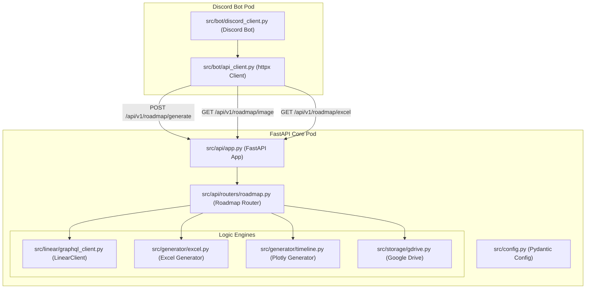

# linmap-bot Components & Modules

This document details the decoupled **Core-API & Worker** pattern of the codebase.

## 1. System Components Diagram

## 2. Logical Split and Modules

### Core-API (FastAPI)
The Core-API is stateless and does the heavy lifting:
* **API Bootstrap (`src/api/app.py`)**: Boots up FastAPI and sets up Swagger API documentation.
* **Roadmap Router (`src/api/routers/roadmap.py`)**: Orchestrates the sync, spreadsheet formatting, Gantt generation, and upload steps.
* **Linear Client (`src/linear/graphql_client.py`)**: Handles retries via `tenacity` and executes GraphQL queries.
* **Excel Engine (`src/generator/excel.py`)**: Uses `pandas` and `xlsxwriter` to compile the active roadmaps into spreadsheets.
* **Timeline Engine (`src/generator/timeline.py`)**: Uses `plotly` and `kaleido` to generate static Gantt PNG files.
* **GDrive Client (`src/storage/gdrive.py`)**: Google Service Account connector to replace old files and output shareable URL links.

### Worker (Discord Bot)
The Worker is a lightweight background daemon:
* **Discord Client (`src/bot/discord_client.py`)**: Establishes connection to the Discord gateway, handles slash commands like `/roadmap`, and schedules weekly updates.
* **API Client (`src/bot/api_client.py`)**: Asynchronously queries `/api/v1/roadmap/generate` on the FastAPI pod.
