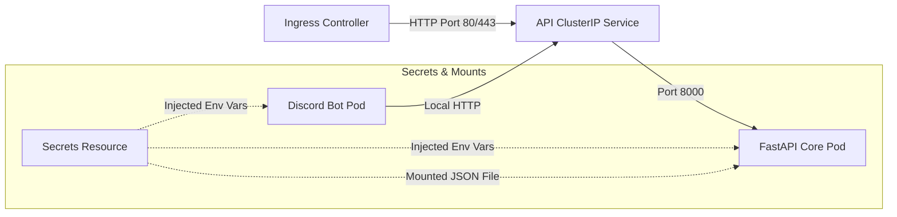

# linmap-bot Deployment & Topology

This document details the deployment structure of the application in Kubernetes (k3s).

## 1. Network Topology

## 2. Secrets & Volume Mount details

* **Environment Secret Map**:
  The common secret resource (`{{ include "linmap-bot.fullname" . }}-secrets`) injects the `LINEAR_API_KEY`, `DISCORD_TOKEN`, and `GOOGLE_APPLICATION_CREDENTIALS_JSON` securely.
* **API Credentials Mount**:
  Because the Google API client requires a local credentials path for Service Accounts, the JSON content under key `GOOGLE_APPLICATION_CREDENTIALS_JSON` is mounted as a file at `/app/secrets/gdrive_credentials.json` on the FastAPI Core container. The path environment variable `GOOGLE_APPLICATION_CREDENTIALS` points directly to this mount.
