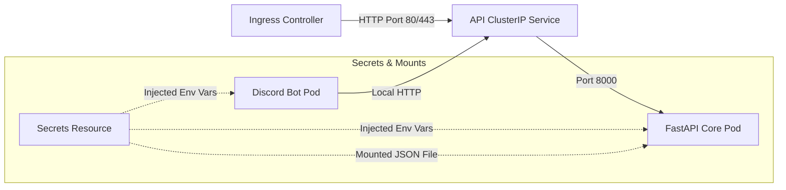

# linmap-bot Deployment & Topology

This document details the deployment structure of the application in Kubernetes (k3s).

## 1. Network Topology

## 2. Secrets & Credentials Injection details

Depending on the `googleCredentials.mode` value set in Helm (configured in `values.yaml`), Google credentials can be supplied in one of two ways:

* **File Mount Mode (`googleCredentials.mode: "file"`, Default)**:
  The common secret resource (`{{ include "linmap-bot.fullname" . }}-secrets`) injects the `LINEAR_API_KEY`, `DISCORD_TOKEN`, and `GOOGLE_APPLICATION_CREDENTIALS_JSON`. The JSON content under `GOOGLE_APPLICATION_CREDENTIALS_JSON` is mounted as a file at `/app/secrets/gdrive_credentials.json` on the FastAPI Core container. The environment variable `GOOGLE_APPLICATION_CREDENTIALS` is automatically set to point to this file path.
  
* **Environment Variable Mode (`googleCredentials.mode: "env"`)**:
  The secret resource injects the credentials JSON content directly under the key `GOOGLE_APPLICATION_CREDENTIALS`. It is injected directly into the container as an environment variable value. The application automatically detects that it is a JSON string and initializes authentication directly in-memory, without creating any temporary files on disk.
