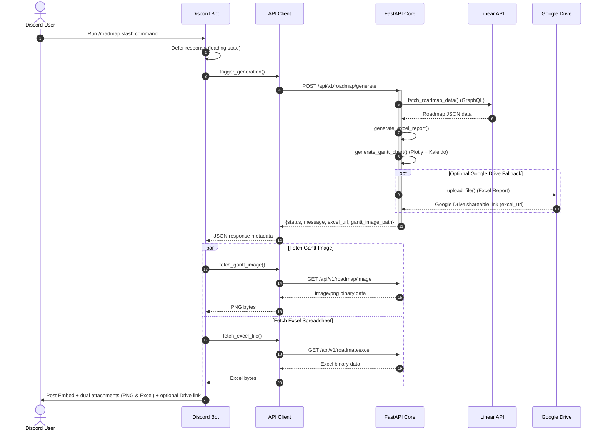

# linmap-bot Sequence & Data Flow

This document outlines the sequential flow of data during generation.

## 1. Sequence Diagram

## 2. Step-by-Step Data Flow

1. **User Request / Scheduler**: An execution is triggered either by a Discord user running the `/roadmap` command or by the background task scheduler `discord.ext.tasks.loop`.
2. **Acknowledgment**: The bot immediately defers the Discord interaction response, presenting a loading/waiting state.
3. **API Dispatch**: The Bot client triggers a REST request to the FastAPI application's `/roadmap/generate` route.
4. **Data Sync**: The FastAPI Core queries the Linear API for all non-canceled and non-archived projects.
5. **Report Generation**: The active projects and milestones are compiled into a formatted Excel sheet and a PNG Gantt chart locally.
6. **Optional Cloud Upload**: If configured, the Excel sheet is uploaded to Google Drive. Any upload failure is handled gracefully without stopping the pipeline.
7. **Asset Retrieval**: The Bot retrieves both the visual Gantt chart image and the Excel spreadsheet binaries in parallel from the FastAPI Core.
8. **Dual-Attachment Broadcast**: The Bot attaches both in-memory file buffers directly to the Discord message alongside a rich embed (which includes the Google Drive link if successfully generated/uploaded).
